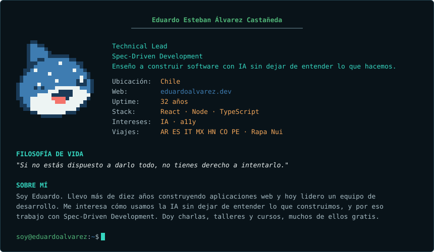
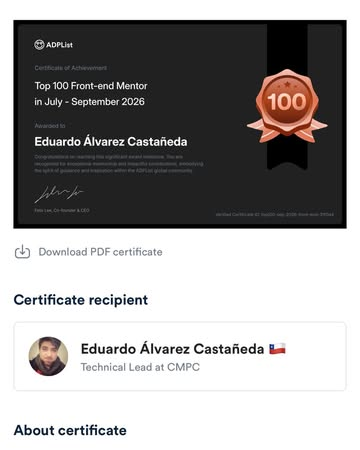
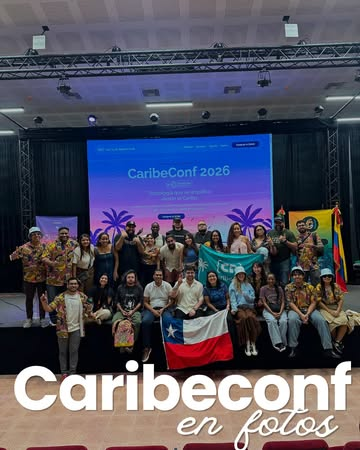

<p align="center">
              
</p>

<p align="center">
  
</p>

```console
$ ls ~/proyectos --destacados
4 repositorios
```

<ul>
    <li><a href="https://github.com/Proskynete/vertical-timeline-component-react" target="_blank"><strong>vertical-timeline-component-react</strong></a> <small>TypeScript · ⭐ 57</small><br /><small>A Timeline Component for React.js</small></li>
  <li><a href="https://github.com/Proskynete/pretty-rating-react" target="_blank"><strong>pretty-rating-react</strong></a> <small>TypeScript · ⭐ 5</small><br /><small>A small and simple component to create icons from a rating</small></li>
  <li><a href="https://github.com/Proskynete/node-api-skeleton" target="_blank"><strong>node-api-skeleton</strong></a> <small>TypeScript · ⭐ 3</small><br /><small>This is a repository meant to serve as a starting point if you want to start a TypeScript express API project with some common features already set up and best practices.</small></li>
  <li><a href="https://github.com/Proskynete/cypress-cucumber-boilerplate" target="_blank"><strong>cypress-cucumber-boilerplate</strong></a> <small>TypeScript · ⭐ 2</small><br /><small>A boilerplate designed to run e2e tests using TS, Gherkins and Linter, generating a report at the end of the execution</small></li>
</ul>

<sub><a href="https://github.com/Proskynete?tab=repositories" target="_blank">ver todos los repositorios</a></sub>

```console
$ cat hobbies.txt
▸ Tocar instrumentos musicales (guitarra eléctrica, guitarra acústica, teclado y ukelele)
▸ Ver anime
▸ Jugar videojuegos
```

```console
$ cat voluntariados.txt
▸ Volunteer Staff           JSConf Chile
▸ Job search preparation    Laboratoria
▸ Mentor                    ADPList
```

```console
$ tail -n 3 ~/adplist/reseñas.log
> "Una gran mentoría, explica todo muy bien, tiene los conceptos muy claro y
  explica demasiado bien"
  — Carlos Eduardo Palomo Serna · 31 de mayo de 2024

> "Me gustaría dar las gracias a Eduardo por su orientación, su enfoque
  profesional y su apoyo."
  — Artem Liamichev · 29 de mayo de 2024

> "Muy profesional y con ganas de ayudar, se toma el tiempo de de preparar bien
  todo el material con las preguntas, tiene muchos conocimientos técnicos y
  habilidades. Muy simpático además. Saque muchas cosas positivas de esta
  reunión y me aclaró bastante la pelicula"
  — Michelle Cifuentes · 22 de mayo de 2024
```

<sub><a href="https://adplist.org/widgets/reviews?src=eduardo-alvarez" target="_blank">ver todas las reseñas en ADPList</a></sub>

```console
$ cat otros.txt
▸ Siempre es un buen momento para hacer un espacio en la semana y tomar una cerveza
  con los amigos.
▸ Publicados en npm: vertical-timeline-component-react v4.4.3
  y pretty-rating-react v2.2.0
▸ Pude participar como profesor en el curso de React en Coderhouse
```

```console
$ ls ~/instagram | head -4
post_01.jpg  post_02.jpg  post_03.jpg  post_04.jpg
```

<a href='https://instagram.com/p/DeK2qCOR-mo' target='_blank'></a><a href='https://instagram.com/p/Dd7hOgblIDd' target='_blank'></a><a href='https://instagram.com/p/DdpaJq3D4KQ' target='_blank'></a><a href='https://instagram.com/p/DdT0q9okVuV' target='_blank'></a>

<sub><a href="https://instagram.com/eduardo_alvarez.dev" target="_blank">ver más en Instagram</a></sub>

```console
$ ls -t ~/blog | head -5
5 artículos
```

- [Cuando ser bueno escribiendo código ya no alcanza](https://eduardoalvarez.dev/articles/cuando-ser-bueno-escribiendo-codigo-ya-no-alcanza)
- [Cómo empezar con Spec-Driven Development: guía práctica para quienes vienen de cero](https://eduardoalvarez.dev/articles/como-empezar-con-spec-driven-development-guia-practica-para-quienes-vienen-de-cero)
- [El agente puede escribir código, pero no puede entender por ti](https://eduardoalvarez.dev/articles/el-agente-puede-escribir-codigo-pero-no-puede-entender-por-ti)
- [El camino hacia mi primera charla internacional](https://eduardoalvarez.dev/articles/el-camino-hacia-mi-primera-charla-internacional)
- [La IA no reemplaza tu experiencia. La pone a prueba](https://eduardoalvarez.dev/articles/la-ia-no-reemplaza-tu-experiencia-la-pone-a-prueba)

<sub><a href="https://eduardoalvarez.dev" target="_blank">ver todos los artículos en eduardoalvarez.dev</a></sub>
